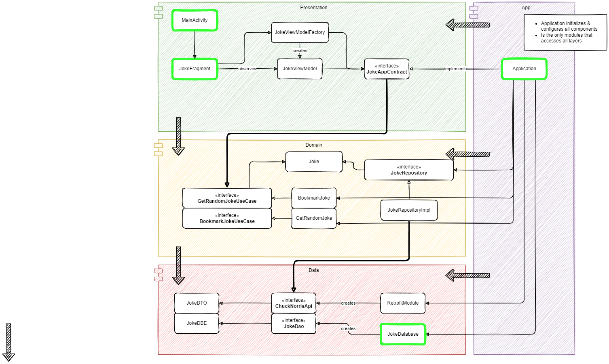

# Chuck Norris Jokes App
Get random Chuck Norris Jokes from https://api.chucknorris.io/ and save them locally to a database if you wish.

The archtecture follows a "Clean architecture" approach using 
 * MVVM
 * Dagger2
 * RxJava2
 * Room
 * Retrofit with RxJava2 and Gson Support
 * MockWebServer for Api call testing

Architecture Design

